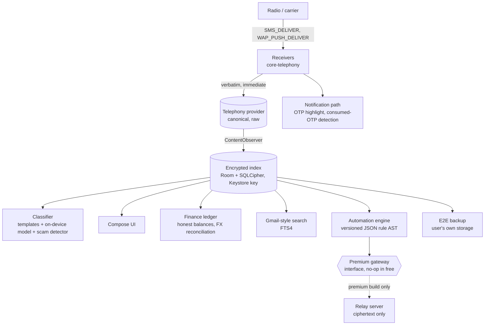

# Dak (डाक)

**The messages that matter, organised, backed up, and never uploaded without your say-so.**

The Android default-SMS app for the OTPs, bank alerts and tickets that Microsoft SMS Organizer's
1M+ users lost when it shut down in May 2026 with no maintained successor. Free tier: 100%
on-device, fully offline, nothing to trust us with. Premium: the same app, plus opt-in server-backed
extras — relay and sync only ever see ciphertext; the few that must read text (cloud categorisation of a
masked message, AI search of your typed query) ask for explicit consent first and can be withdrawn any time
(see the [privacy policy](docs/privacy-policy.md)).

[](https://github.com/sausin/dak/actions/workflows/android.yml)


Full product spec: [`docs/build-plan.md`](docs/build-plan.md) · Build status: [`docs/status.md`](docs/status.md)

---

## Why Dak

SMS Organizer didn't lose to a better competitor — it [died of a notification bug](docs/build-plan.md#lessons-from-sms-organizer-and-mezo):
its Play rating fell to 3.1 across 51.7K reviews, and the top complaints were weeks without
notifications and missed OTPs. Nobody has shipped a real successor. The nearest FOSS alternatives
(QUIK, Fossify Messages, Deku SMS) are all GPLv3, 2015-era XML-view codebases with no
categorisation, no finance parsing, and no data layer worth keeping.

Dak is a ground-up rebuild in Kotlin + Jetpack Compose that starts from the one thing the
incumbents got right — **the messages that matter are OTPs, bank alerts, and tickets, not chats**
— and takes reliability, privacy and India-specific fraud defence as seriously as any feature.

## What sets Dak apart

- **Privacy by architecture, not by policy.** The free tier cannot phone home even if it wanted
  to — this is enforced in CI (see [Security & privacy](#security--privacy)), not just promised.
- **Reliability first.** The exact class of bug that killed the last app in this space —
  notifications — gets a dedicated self-test, OEM-killer guidance, and a P0 checklist that ships
  before any smart feature.
- **Real scam defence for India**, not a generic spam filter: a fake bank-credit-alert detector,
  homograph link warnings, and one-tap access to 1930/1909/Chakshu.
- **Honest engineering status.** Nothing here has touched a real device yet. This README says so
  plainly — see [Status & roadmap](#status--roadmap).

## India first, useful anywhere

Dak launches for India, where its data is richest: TRAI DLT sender headers, Indian bank and
wallet formats, Hindi/Hinglish phrasing, the fake-credit-alert scam playbook, and verified
helplines (1930, 1909, Chakshu). Nothing is hard-wired to India, though. A region profile is
resolved per SIM (SIM home country → network → device locale, never assumed), and everywhere
else Dak falls back to generic behaviour:

| | India (launch profile) | Other countries (today) |
| --- | --- | --- |
| Sender trust | DLT header rules (`XX-HDFCBK-S`), brand folding from the bundled table | Generic sender handling; DLT rules off |
| OTPs, search, themes, backup, multi-SIM | ✓ | ✓ (tested with US/UK/EU/UAE/SG-style OTPs, Arabic-Indic digits) |
| Finance | Indian banks/wallets, lakh/crore grouping, INR | Home currency from the SIM's country; `$`, `£`, `€`… resolved per region; ISO codes shown for foreign amounts |
| Scam defence | DLT-aware fake-credit detection + generic signals | Generic signals (unknown sender + "credited" + return/refund urgency, payment links) |
| Fraud help | 1930 / 1909 / Chakshu / RBI | Verified emergency numbers + "add your bank's fraud line" |

Country-specific data for other markets comes later; the region seam is already in place.

## Feature highlights

### Reliable by construction
- Verbatim `SMS_DELIVER` → `Telephony.Sms` write happens before anything else — OTP autofill and
  banking-app SMS Retriever listeners keep working no matter what Dak's own code does.
- MMS download with per-SIM APN, retry/backoff, and a visible "tap to retry" failure reason —
  the exact gap SMS Organizer never closed.
- In-app self-test, a restriction banner for OEM battery killers (Xiaomi/Oppo/Vivo/Realme), and
  `ContentObserver` + periodic reconcile so new messages never require leaving and re-entering a
  thread.
- Big, bold OTP notification, copied to the clipboard on arrival (flagged sensitive, "Copied" shown
  beside the code; a Copy button if auto-copy is off) with Mark read and Delete; **consumed-OTP detection** via the
  same SMS Retriever app-signature hashes Google publishes, so an OTP already read by your banking
  app goes silent and auto-deletes instead of nagging you.
- Sender merge groups fold `VM-HDFCBK` / `JD-HDFCBK` / `AX-HDFCBK` into one "HDFC Bank" thread —
  a feature users explicitly asked for on Samsung's forums.

### Scam defence built for the Indian SMS ecosystem
- **Fake-credit-alert detector** (`android/classify/.../scam`): scores messages against 17
  distinct signals — a bank-style credit from a 10-digit phone number, a promotional-route
  transactional message, brand/sender mismatches, "sent by mistake, please return" wording (in
  English and Hindi/Hinglish), UPI collect-request and "PIN to receive" tricks (a PIN is only ever
  needed to *pay*), and same-sender follow-up "return it" messages. Anything flagged `LIKELY_SCAM`
  is kept out of the finance ledger entirely, never silently trusted.
- **Lookalike/homograph link warnings**: confusable Cyrillic/Greek/Armenian/fullwidth letters are
  folded to a Latin skeleton so `hdfcbаnk.com` is caught as impersonating HDFC Bank; userinfo
  tricks (`https://bank.com@evil.xyz`) are stripped and flagged; links only open after a second,
  explicit tap.
- **Fraud helpline screen**: 1930 (cybercrime helpline) first, then 1909 TRAI SMS spam report
  (built from the composer), Chakshu / cybercrime.gov.in with details pre-filled, and the user's
  own bank card-block number — all from a signed helpline bundle sourced only from each
  authority's own site, never a forum or search result.
- **SMS cost warnings** before a send that would leave the user's normal plan/rate.
- **Red-teamed input surfaces**: a seeded structure-aware MMS PDU fuzzer (120k iterations), zip-slip
  and zip-bomb hardening on every import/restore path, ReDoS-safe regexes with a static safety
  checker for user-authored automation patterns, and JSON/XML nesting-bomb guards. Full surface-by-
  surface writeup in [`docs/security/threat-model.md`](docs/security/threat-model.md).

### Fast to use, one-handed
- **Inbox built for the thumb**: a bottom bar (places, search, compose FAB) instead of top-bar
  search/overflow, configurable swipe actions (archive/delete/read/pin, with haptics, Undo and a
  TalkBack alternative for every gesture), long-press multi-select with a bottom action bar, and an
  inline **"Copy code" chip** on fresh OTP rows — the code without opening the thread.
  In conversation: long-press multi-select (copy, forward, delete with confirmation, and the per-message
  action sheet for a single selection), double-tap a bubble to copy its code or amount (codes under a day old),
  swipe-to-reply with any OTP in the quote masked, and a jump-to-latest FAB. Full review and what
  shipped vs. deferred: [`docs/ux-review.md`](docs/ux-review.md).
- **Delivery ticks** on outgoing messages (clock → single ✓ sent → double ✓✓ delivered, or a
  failed/retry state), refreshed from a coalesced provider re-check rather than a new wakeup.
- **Typed tappable entities** inside message text — phone, OTP, amount, masked account, UPI id,
  reference/UTR, PNR, courier tracking — each with the action that makes sense for it (call/save a
  number, copy a code); a scam-flagged message's phone number and UPI id warn before acting on them.
- **App lock**: device lock (fingerprint/face/PIN via the system prompt) or an app PIN (PBKDF2,
  salted hash only, escalating lockout on wrong tries), auto-lock timeout, "hide in Recents"
  (`FLAG_SECURE`), and per-screen sensitive gating (bin, passbook, backup, automations, forwarding)
  even with the lock off.

### Smart, but entirely local
- DLT sender-header parsing (`VM-HDFCBK-S` → bank, traffic type) and brand folding/unfolding.
- On-device classifier (deterministic template rules + a pure-Kotlin model) sorting messages into
  Personal / Transactions / OTP / Promotions / Spam — no network round trip.
- Gmail-style search (`from:`, `category:`, `sim:`, `amount:>500`, `during:"last week"`, …) over a
  SQLCipher-backed FTS index, with saved searches and a preserved back stack.
- **Amount normalisation**: `500,000.00`, `5,00,000`, `500000` and `5 lakh` are all the same amount
  in search and the ledger (`amount:>50k`, `amount:1L..1cr` work too).
- **Passbook grouped by instrument** — bank accounts, credit cards, debit cards, wallets, UPI,
  prepaid/forex cards, loans — that keeps every transaction in its **original currency**, shows
  balances as `"unknown since <date>"` rather than inventing a number after a foreign spend, and
  reconciles the indicative FX estimate against the bank's own settlement message days later. A
  debit-card or loan spend also reduces the linked bank account when the SMS names it explicitly.
- Masked-account alias confirmation, so a passbook account is only linked to a bank once the
  masked digits actually match something the user confirmed.
- **Broadcast lists with guardrails**: one message to up to 50 people, sent as individual SMS
  (replies come back 1:1), hard caps of 50/broadcast and 100/day, a versioned acceptable-use
  agreement on first use, an on-device spam-risk check with an extra confirmation, and a TRAI/1909
  note — see [`docs/terms-acceptable-use.md`](docs/terms-acceptable-use.md).
- **Scheduled messages with a heads-up**: shortly before a scheduled text, broadcast or automatic
  birthday wish goes out (15 minutes by default; off / 5 / 15 / 60 in Settings → Automations, plus a
  morning heads-up for a wish sent later that day), a notification offers **Send now**, **Delay**
  (+1 hour, tomorrow same time, or pick a time) and **Cancel**. Several are grouped under one summary;
  Send now goes through the same checks as the scheduled send (app lock, premium-rate guard, daily
  cap). Texts to emergency numbers cannot be scheduled — send them straight away instead.
- Time-boxed auto-forwarding rules ("forward my HDFC transactions to my CA until 5:30 pm") to
  saved contacts only (re-checked before every forward; a deleted contact pauses the rule), one
  hour by default; longer or open-ended periods, extensions, OTPs and risky-looking recipients
  (recently added contact, no SMS history, unusual number) need a scam warning plus biometric
  confirmation. A persistent visible warning shows while any forwarding rule is active, and cost
  warnings appear before a send that would leave the user's plan/rate. Anything that sends messages
  off the phone automatically (forwarding, auto-replies, webhooks, relays) needs app lock: without it
  such rules cannot be turned on, and switching app lock off (or removing the phone's screen lock)
  turns them off, with a clear notice first. Three hours after one is turned on, and daily while it
  stays on, a "Was this you?" security alert (with a one-tap "Turn off") makes sure the owner notices
  a rule someone else set up. Ended rules stay saved and can be used again for the same length of
  time, and every rule has a history of exactly which messages it sent, where, and what was skipped.
  Notification channels per kind (Messages, OTP codes, Alerts, Promotions, General, Spam) can be
  split per SIM and per conversation.
- Birthday/anniversary wishes from Contacts, opt-in, "ask first" or "send automatically", with
  English/Hindi templates.
- Fake-credit scam detection flags a message before it ever reaches the passbook, with one-tap
  access to fraud helplines (1930/1909/Chakshu/RBI).
- Multi-SIM as a first-class dimension everywhere: SIM chips on every thread and bubble, per-SIM
  reply, roaming-aware E.164 number normalisation, roaming send warnings.
- Unicode/Indic digits (Devanagari, Arabic-Indic) handled in masking and parsing; 30+ ISO 4217
  currencies with correct minor-unit exponents (0 for JPY, 3 for KWD); RTL-safe rendering.

## Architecture

One Android app. The system Telephony provider stays raw and canonical; every smart feature reads
from Dak's own encrypted index, never from the provider directly, and the premium gateway is a
real interface with a no-op implementation in the free build — so free and premium are one
codebase, not a fork.



## Security & privacy

The free tier's offline promise is a build guarantee, not a policy statement:

- **CI-enforced offline baseline.** [`android/scripts/check-offline-baseline.sh`](android/scripts/check-offline-baseline.sh)
  runs on every push ([`.github/workflows/android.yml`](.github/workflows/android.yml)) and fails
  the build if any code outside `src/premium` references a network client (OkHttp, Retrofit, Ktor,
  raw `HttpURLConnection`, WebSocket), an AI/Firebase SDK, or binds a real cloud classifier. The
  only network path anywhere in the free tier is the platform's own MMS download over the carrier
  APN — Dak never fetches a URL itself.
- **Encrypted index**: Room over SQLCipher, key wrapped in the Android Keystore. Rebuildable from
  the Telephony provider at any time; the provider is always the source of truth.
- **End-to-end encrypted backup** to the user's own storage (Drive/Dropbox/local via SAF) —
  passphrase or device key plus recovery code, never plaintext leaves the device.
- **Open export format from day one** (`shared/formats/dak-export-v1.md` + JSON Schema): a ZIP of
  a manifest, JSONL message chunks, and attachments, optionally wrapped in the `DAKENC1`
  encryption envelope. Nothing is ever trapped in a proprietary format — the exact complaint that
  made SMS Organizer's shutdown so painful for its users.
- **No WebView anywhere.** Links open only in the user's own browser, only after an explicit
  second tap past the link-safety check.
- **Red-team hardened input surfaces**, tracked in [`docs/security/threat-model.md`](docs/security/threat-model.md):
  a clean-room MMS PDU decoder with bounds-checked length fields, a `MAX_PARTS`/`MAX_ADDRESSES`/
  size-truncation ceiling on every PDU, zip-slip-proof attachment names (64-hex-only), zip-bomb
  caps on every decompression path, XML billion-laughs and DTD-entity protection, PBKDF2
  iteration-count bounds, and a static safety checker (`RegexSafety`) that refuses catastrophically
  backtracking patterns before a user-authored automation rule ever runs.
- **Exported surface kept minimal**: only `MainActivity` and the three platform-guarded telephony
  receivers are exported; every result/boot/notification receiver is not; `allowBackup=false`;
  PendingIntents are explicit.
- The threat model also lists open app-UI findings from the wave-2a red-team pass (intent-route
  injection, a confused-deputy `EXTRA_STREAM` path, MIME-type trust on attachment open) that are
  reported but not yet fixed — see the document for the full, honest list.

## Performance

Every message runs through classification, transaction parsing, fake-credit checks, link detection
and FTS text normalisation. That path was profiled and cut roughly in half per message, with the
old and new code proven to give **identical results** (same categories, confidences, OTPs and
transactions — no re-index needed). Measured on a 50,000-message synthetic corpus, JVM 21:

| Path (msgs/s, higher is better) | Before | After |
| --- | ---: | ---: |
| Classification only, 1 thread | 27,300 | 113,000 |
| Full enrichment path, 1 thread | 7,000 | 14,200 |
| Full enrichment path, 3 threads (as the indexer runs it) | 7,000 | 35,800 |

A single-pass Aho-Corasick keyword prefilter skips regexes that cannot match, shared per-message
analysis is computed once instead of three times, and the index writer now enriches on up to 3
background threads with a single writer. A baseline profile (`app/src/main/baseline-prof.txt`)
covers the hot classify/finance/index packages for AOT compilation. Full method, correctness proof
and per-stage breakdown: [`docs/performance.md`](docs/performance.md).

## Battery

The default-SMS role means the platform wakes Dak for every message; everything *on top of that*
has to be close to free. Full breakdown of every background trigger, before/after numbers, and the
rules that keep new work from regressing this is in [`docs/battery.md`](docs/battery.md). Headline
numbers for the reference "heavy user" (300 SMS/day, 60 OTPs):

| | Before hardening | After hardening |
| --- | --- | --- |
| Jobs Dak schedules itself, per day | ~66–126 | ~37–47 |
| OTP-delete jobs (was one per OTP) | 60 (up to 120 with churn) | ~35–45 batched sweeps |
| App-signature package scans | ~150 (every process start) | at most 1/day |
| Wakeup alarms Dak owns | 0 | 0 (unchanged — user-scheduled sends excepted) |

Hard rules behind those numbers: no wakeup alarms of Dak's own, no wake locks held across work,
no foreground service beyond the one the platform requires for MMS download, one shared job per
purpose rather than one job per message, and all heavy init (Keystore unwrap, SQLCipher open,
classifier JSON parse) deferred and lazy.

## Status & roadmap

**Nothing has run on a real device yet.** Everything below compiles and is unit-tested in CI; the
Phase 0 device pass (a Pixel and a Xiaomi, two SIMs, OTP autofill in Chrome and two banking apps,
self-test with battery optimisation on) is the next gate before any of this is a real claim about
a working app. Full detail: [`docs/status.md`](docs/status.md); the step-by-step first-phone
checklist is [`docs/device-test-plan.md`](docs/device-test-plan.md).

| Phase | Scope | State |
| --- | --- | --- |
| 0 — Spike | Default-SMS role, verbatim provider write, MMS download, multi-SIM send/receive, thread UI, premium seams | Built in CI; **device pass not yet run** |
| 1 — MVP (free) | Encrypted index, classifier, search, composer, themes, OTP lifecycle, recycle bin, backup/export, importers, reliability tooling | Built in CI |
| 2 — Finance + automations | Passbook, FX reconciliation, automation engine, link safety, scam detector, duplicate-OTP collapse | Built. OTA template fetching, Safe Browsing lookups, crowd spam reports, and the full TRAI 1909 flow are not yet implemented |
| 3 — Premium | Play Billing, translation, AI-assisted search, web/desktop relay client, webhooks, send API | **Seams and locked UI only** — `PremiumGateway`, `Entitlements`, `Translator`, `QueryUnderstanding` all exist as interfaces with no-op free bindings; no real implementation exists yet |

Known gaps worth knowing about before you rely on any of this: Room schema JSON isn't committed
yet (write real migrations once it is), delivered-message state isn't surfaced in the UI, and R8
is disabled on release builds until keep rules are verified on a device. Full list in
[`docs/status.md`](docs/status.md#known-gaps--follow-ups).

There is **no Play Store listing**. This is pre-device-test software.

## Repository layout

| Path | What | Status |
| --- | --- | --- |
| [`android/`](android/) | The app: Kotlin + Jetpack Compose, Gradle multi-module, `free` / `premium` flavours | Active |
| [`ios/`](ios/) | Future `ILMessageFilterExtension` + companion (no SMS API on iOS; no parity promise, ever) | Placeholder |
| [`web/`](web/) | Future premium web/desktop client over the ciphertext relay | Placeholder |
| [`shared/formats/`](shared/formats/) | Platform-neutral formats: open export format, template bundle, automation rule AST, helplines bundle | Specs |
| [`docs/`](docs/) | Build plan, implementation status, battery budget, security threat model | |

The premium relay server lives in a separate repository — by design, it only ever sees ciphertext.

### Android modules

```
android/
  core-model/        shared types (Message, Category, SimInfo, ExtractedTransaction…)      [JVM]
  premium-api/       tier seams: Entitlements, PremiumGateway, Translator, QueryUnderstanding [JVM]
  classify/          DLT sender parsing, templates, OTP extraction, scam detector, model    [JVM]
  finance/           transaction parser, ledger, honest balances, FX + reconciliation       [JVM]
  automations/       rule AST (versioned JSON), pure engine, action registry, send limiter  [JVM]
  search/            Gmail-style query language → AST → FTS                                [JVM]
  backup/            open export format, E2E encryption, SMS Backup & Restore / Fossify     [JVM]
  settings-registry/ declarative settings registry + search                                [JVM]
  mms-pdu/           clean-room MMS PDU codec                                               [JVM]
  core-telephony/    receivers, provider I/O, SMS/MMS send + download, SIMs                 [Android]
  core-index/        encrypted index (Room + SQLCipher), backfill, sync, recycle bin        [Android]
  app/               Compose UI; `free`/`premium` flavours differ only in Hilt bindings     [Android]
```

JVM modules have no Android dependency, so their logic is unit-tested fast (no emulator, no
instrumentation) and can be reused by a future iOS or web client. Each module has its own README
with its public API — start there for module-level detail: [`android/app`](android/app/README.md),
[`android/automations`](android/automations/README.md), [`android/backup`](android/backup/README.md),
[`android/classify`](android/classify/README.md), [`android/core-index`](android/core-index/README.md),
[`android/core-telephony`](android/core-telephony/README.md), [`android/finance`](android/finance/README.md),
[`android/mms-pdu`](android/mms-pdu/README.md), [`android/search`](android/search/README.md),
[`android/settings-registry`](android/settings-registry/README.md).

As of this writing the test suite carries roughly **929 `@Test`s across 116 files**, concentrated
in the JVM modules where logic can be checked without a device or emulator.

## Build

Requires JDK 17 and the Android SDK (`compileSdk 37`, `targetSdk 36`, `minSdk 26`).

```sh
cd android
./gradlew test                                    # all unit tests
./gradlew assembleFreeDebug assemblePremiumDebug   # debug APKs, both flavours
```

Without the Android SDK, the JVM modules still build and test on their own:
`android/scripts/jvm-test.sh`.

### CI

[`.github/workflows/android.yml`](.github/workflows/android.yml) runs on every push and pull
request: the offline-baseline guard, the full unit-test suite, and debug APK builds for both
flavours (uploaded as workflow artifacts, `dak-debug-apks-<run>`). Tags matching `v*` attach APKs
to a GitHub release. Signed release APKs build automatically when the repository secrets
`DAK_KEYSTORE_BASE64`, `DAK_KEYSTORE_PASSWORD`, `DAK_KEY_ALIAS` and `DAK_KEY_PASSWORD` are set.
Play Store `.aab` publishing is a later step.

### Free vs. premium seam

One Gradle project, two product flavours differing only in which `PremiumGateway` and
`Entitlements` implementations Hilt binds. Free binds no-ops for everything server-backed
(translation, AI-assisted search, webhooks, the web relay client, the inbound send API); premium
binds the real thing. The data model is identical across both — premium never adds a column to the
index — so a purchase unlocks rows in place, with no reinstall and no fork to keep in sync. Full
capability table in [`docs/build-plan.md`](docs/build-plan.md#free-vs-premium).

## Contributing & decisions

- Product thesis, phased roadmap, and the full feature spec: [`docs/build-plan.md`](docs/build-plan.md)
- What's actually built vs. planned, module by module: [`docs/status.md`](docs/status.md)
- Background-work budget and the rules new code must follow: [`docs/battery.md`](docs/battery.md)
- Threat model and open security findings: [`docs/security/threat-model.md`](docs/security/threat-model.md)
- Open decisions still on the table — package id (`app.dak`) and the name "Dak" are working
  choices, along with the Jev free-tier cap, backup destinations at launch, open-source posture,
  and beta-cohort recruiting — are listed at the end of the build plan.
