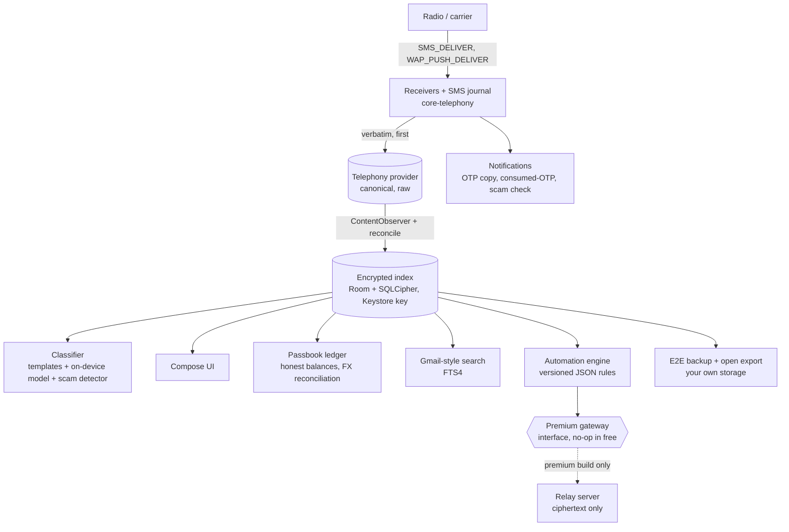
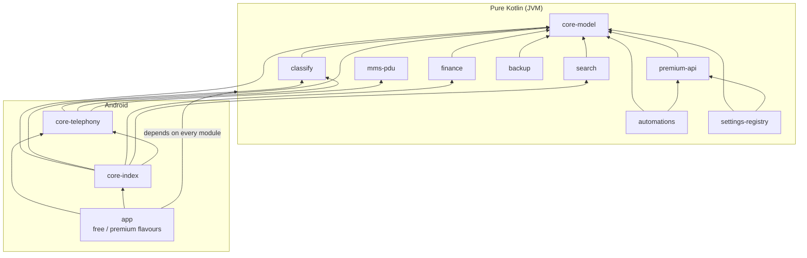

<div align="center">

# Dak (डाक)

**The messages that matter, organised, backed up, and never uploaded without your say-so.**

An open-source Android default-SMS app for the OTPs, bank alerts and tickets that people actually live by.
It is built as the successor to Microsoft SMS Organizer, India first and usable anywhere.

[](https://github.com/sausin/dak/actions/workflows/android.yml)
[](docs/testing.md)


[](LICENSE)

[Features](#features) · [Privacy](#security--privacy-by-architecture) · [Hardened against attack](#hardened-against-attack) ·
[Engineering](#engineering-quality) · [Architecture](#architecture) · [Get started](#getting-started) ·
[**Contribute a scam message**](#contribute-an-adversarial-message) · [Roadmap](#status--roadmap)

</div>

---

> [!TIP]
> **You can help without writing Kotlin.** Got a scam SMS, a phishing link or a message that trips up SMS apps?
> Add it to the [adversarial corpus](shared/adversarial/): it is plain text, one message per line, and CI runs every
> line through Dak's defences. [How to contribute a message ↓](#contribute-an-adversarial-message)

## At a glance

| | |
| --- | --- |
| **What** | A full default-SMS/MMS app for Android 8.0+ (`minSdk 26`, `targetSdk 36`) in Kotlin and Jetpack Compose |
| **Free tier** | Works entirely on the phone and offline, with no ads, analytics or crash reporting. A CI script fails the build if free code reaches for the network ([`check-offline-baseline.sh`](android/scripts/check-offline-baseline.sh)) |
| **Premium** | Same codebase and data model. Optional server features are consent-gated seams; none is implemented yet ([status](#status--roadmap)) |
| **Codebase** | 12 Gradle modules (9 pure-Kotlin JVM, 3 Android), about 73k lines of production Kotlin and 31k lines of tests |
| **Tests** | About 1,850 JUnit/Robolectric `@Test`s in 230 files, plus a 400+ message [adversarial SMS corpus](shared/adversarial/) and seeded MMS fuzzers |
| **Gates** | Offline guard, tests, per-module coverage floors, R8 release builds and a mapping check, on every pull request and push to `main` that touches the app ([workflow](.github/workflows/android.yml)) |
| **Status** | The maintainers have tested it extensively. It is not on the Play Store yet ([details](#status--roadmap)) |

## Why Dak

Microsoft SMS Organizer began shutting down in May 2026. It had 1M+ installs and left no maintained successor.
It did not lose to a better competitor. It [died of a notification bug](docs/build-plan.md#lessons-from-sms-organizer-and-mezo):
its Play rating fell to 3.1 across 51.7K reviews, and the top complaints were weeks without notifications and
missed OTPs. The closest open-source alternatives (QUIK, Fossify Messages, Deku SMS) are GPLv3 XML-view
codebases with no categorisation, no finance parsing and no data layer worth keeping.

Dak is a ground-up rebuild that keeps the one thing SMS Organizer got right: **the messages that matter are
OTPs, bank alerts and tickets, not chats.** It treats reliability, privacy and fraud defence as features in their
own right:

- **Reliability comes first.** Notifications, the bug class that killed the last app in this space, get a
  self-test, OEM battery-killer guidance, a crash-safe receive journal and a P0 checklist that ships before any
  smart feature.
- **Privacy is part of the architecture.** The free tier cannot phone home, and CI checks this on every build.
- **Scam defence is built for how Indian SMS fraud works.** It is not a generic spam filter. The adversarial
  corpus lets anyone add the next scam as a test.
- **Your data stays open.** A documented export format is available from day one, so nobody is ever trapped the
  way SMS Organizer's users were.

---

## Features

Everything below is in the tree and runs on the phone. Server-backed premium features are listed only in the
[roadmap](#status--roadmap).

### Reliable by construction

| | |
| --- | --- |
| **Verbatim first write** | Each `SMS_DELIVER` is journalled (fsync'd) and written to the system Telephony provider before any Dak logic runs, so OTP autofill and banking apps' SMS Retriever keep working whatever Dak does next |
| **Crash-safe receive** | The `SmsJournal` replays any message whose inbox write failed or timed out, at the next receive, at boot and at app start. Handler crashes, including `StackOverflowError`, are contained |
| **MMS that works** | Per-SIM APN download with retry and backoff, a visible "tap to retry" failure reason, carrier config read per SIM, group MMS, SMIL and read reports |
| **Self-test and OEM guidance** | Settings → Notifications → Self-test, a restriction banner for Xiaomi, Oppo, Vivo and Realme battery killers, and `ContentObserver` plus periodic reconcile so a thread never needs reopening to show new messages. The default SMS app counts as battery-exempt, so the banner never asks for a fix Android won't allow |
| **Delivery ticks** | Clock, then ✓ sent, then ✓✓ delivered, or a failed state with retry |
| **Emergency texts never wait** | Texts to 112/911 and the region's emergency numbers skip the send rate limiter and cannot be scheduled |

### Organised automatically, entirely on the device

- **Tabs**: Personal, Transactions, OTP, Promotions and Spam. Messages are sorted by deterministic template rules
  plus a bundled pure-Kotlin model, with no network round trip.
- **DLT sender parsing** (`VM-HDFCBK-S` → bank, traffic type) and **sender merge groups** that fold
  `VM-`/`JD-`/`AX-HDFCBK` into one "HDFC Bank" thread. You can unfold them.
- **Gmail-style search** over an encrypted FTS index: `from:`, `category:`, `sim:`, `has:otp|link|attachment`,
  `amount:>500`, `amount:1L..1cr`, `before:`/`after:`, `during:"last week"`, `in:`, `is:`, with chips, saved
  searches and a preserved back stack ([`android/search`](android/search/README.md)).
- **Amounts are normalised**: `5,00,000`, `500,000.00`, `500000` and `5 lakh` are the same amount everywhere.
- **Typed, tappable entities** in message text: phone, OTP, amount, masked account, UPI id, UTR, PNR and courier
  tracking number, each with the action that fits it.
- **App language**: Settings → Appearance → Language uses the per-app language on Android 13+ and Dak's own
  override on 8–12. Money uses the locale's digits, keeping lakh/crore grouping. The UI ships in English today, and
  every screen, setting and failure reason is a translatable resource ([`docs/i18n.md`](docs/i18n.md)).
- **Themes**: light, dark, AMOLED and high contrast, following the system and switching live. Typography scales
  with the screen size.

### OTPs, done right

- A big, bold OTP notification. The code is **copied on arrival** (flagged sensitive, with "Copied" shown next to
  it) and there are Mark read and Delete actions.
- **Consumed-OTP detection**: Dak uses the SMS Retriever app-signature hashes Google publishes, so an OTP your
  banking app already read goes quiet and auto-deletes.
- A "Copy code" chip on fresh OTP rows in the inbox, and double-tap to copy in a thread. Both work only for codes
  less than a day old.
- The recycle bin keeps OTPs for one day. Duplicate OTPs collapse.

### Passbook: your money, read from your SMS

- **Grouped by instrument**: bank accounts, credit and debit cards, wallets, UPI, prepaid and forex cards, loans,
  **mutual-fund folios and demat accounts**.
- **Honest balances**: every transaction is kept in its **original currency**. A balance shows
  `"unknown since <date>"` instead of an invented number after a foreign spend. The indicative FX estimate is
  later reconciled against the bank's own settlement SMS.
- **SIPs are own-account transfers**, so they are never counted as spending. Demat security alerts (shares debited,
  pledge, e-DIS) always notify you.
- **Masked-account aliases** link to a bank only after you confirm the digits match.
- **Remove an account from the Passbook** with a long-press and Undo. A collapsed "Hidden accounts" section brings
  it back. Hiding only changes the display: the ledger and scam detection still see the account.
- Anything flagged as a likely scam **never reaches the ledger**.

### Scam and fraud defence

| Defence | What it does |
| --- | --- |
| **Fake-credit-alert detector** | Scores messages against 20 weighted signals (`ScamReason`): a bank-style credit from a phone number, a promotional-route "transaction", brand/sender mismatch, "sent by mistake, please return" wording in English, Hindi and Hinglish (including follow-ups from the same sender), UPI collect requests and "enter PIN to receive" bait. Write-up: [`fake-credit-scams.md`](docs/security/fake-credit-scams.md) |
| **Scam families beyond fake credits** | Template rules (bundle 5) for callback scams with no link, "Hi Mum, new number", requests to send back a code, APK links, release fees, loan extortion, arrest threats and police "safe account" scams, in English, Hindi, Arabic, Dutch, Spanish and French wording. Each new rule was written against benign look-alikes that must stay clean |
| **Consistent everywhere** | The notification, the thread banner, the inbox chip and the entity sheet all get the same context (parsed amount, known accounts, recent messages from the sender), so they agree. Turning warnings off only hides them: automations still refuse to forward a likely fake |
| **Link safety** | Confusable Cyrillic, Greek, Armenian and fullwidth letters are folded (UTS #39), so `hdfcbаnk.com` is caught. Userinfo and backslash tricks (`https://bank.com@evil.xyz`) are flagged. An official domain used as a prefix (`sbi.co.in.verify.example`) counts as a look-alike, as do bare-IP hosts and government words on non-government domains (`gov-uk-support-payment.com`). Links always need a second tap, with a reason shown |
| **Spoofed senders and hidden text** | Mixed-script and look-alike sender names are flagged. Detection reads a normalised copy of each message: right-to-left overrides are applied as displayed, invisible characters are dropped and combining-mark floods are capped. A bidi-reversed amount or a `K\u200BYC` cannot slip past, and the text you see is untouched |
| **Report fraud** | 1930 (cybercrime helpline) first, then TRAI 1909 (built from the receiving SIM), Chakshu and cybercrime.gov.in with details pre-filled, RBI, and your own bank's card-block number. Numbers come from a signed [helplines bundle](shared/formats/README.md) sourced from each authority's own site |
| **Cost guards** | Warnings before a send leaves your normal plan or rate, and a premium-rate check on unattended sends |

### Privacy and incognito chats

- **Incognito chats**, per conversation, from the moment you turn them on:
  - Sent messages are deleted once the radio confirms them. Received ones are deleted after a 10-second reading
    window in the thread, or when you leave it.
  - Notification and inbox previews never show the text. Deletions skip the recycle bin. Bubbles **dissolve** on
    screen.
  - A failed send is never silently dropped or kept. The thread shows **Retry / Delete** with a visible 30-second
    countdown. If the retry also fails, you choose **Keep / Delete**.
  - The first time you turn it on, a one-time **"Only your copy vanishes"** notice explains that the other phone
    keeps what it received.
  - **Automations never forward, relay or webhook an incognito chat's messages.** The run log records why they
    were skipped.
- **App lock**: device biometrics or credential, or an app PIN (PBKDF2, salted hash, escalating lockout). Also
  auto-lock, "hide in Recents" (`FLAG_SECURE`) and per-screen gating for the bin, Passbook, backup, automations and
  forwarding.
- **Your data rights in the app**: Settings → Privacy → *Export my Dak data* and *Delete my Dak data*, and an
  append-only consent ledger ([`privacy-compliance.md`](docs/privacy-compliance.md)).

### Conversations and composer

- **Contact details from the thread header**: tap it to call, copy, view the contact, or **save an unsaved number**
  as a new or existing contact.
- **Send later from the composer**: use "Schedule" in the attachment tray or long-press Send. Choose in an hour,
  tomorrow, or any date and time. Pending messages sit in a strip above the composer, where you can cancel them.
- **Heads-up before scheduled sends**: a notification offers Send now, Delay or Cancel. It runs 15 minutes before
  by default (configurable).
- One composer with attachments, automatic SMS→MMS switching, a segment counter and group MMS.
- **Built for one hand**: a bottom bar, configurable swipe actions with Undo and TalkBack alternatives,
  multi-select in the inbox and in threads, swipe-to-reply with OTPs masked in the quote, and a jump-to-latest
  button ([UX review](docs/ux-review.md)).

### Automations and forwarding, with guardrails

- **A rule engine**: versioned JSON rules, on-device actions, and a `RegexSafety` static check that refuses
  catastrophically backtracking patterns.
- **Forward messages**: select messages in a thread and forward them through the composer.
- **Time-boxed auto-forwarding** ("forward my HDFC transactions to my CA for an hour"):
  - Recipients come from **saved contacts only** and are re-checked before every forward. A deleted contact pauses
    the rule.
  - Periods longer than an hour, open-ended rules, OTPs and risky-looking recipients (recently edited contact, no
    SMS history, unusual number) need a scam warning plus biometric confirmation.
  - **Anything that sends off the phone needs app lock.** Turning the lock off turns those rules off.
  - A **"Was this you?"** alert fires 3 hours after a rule is turned on and daily after that, with one-tap Turn off.
  - Every rule has a history of what it sent, where, and what it skipped.
- **Broadcast lists**: individual SMS to up to 50 people, capped at 100 a day, paced within Android's limits. They
  come with an on-device spam-risk check and a first-use [acceptable-use](docs/terms-acceptable-use.md) agreement.

### Birthdays and occasions

- Birthdays, **anniversaries and other contact dates** ("Other" or a custom label) appear on one screen, filtered
  by one chip row.
- Wishes can be "ask first" or "send automatically", with English and Hindi templates, an `{occasion}`
  placeholder and presets.
- **Add a date** opens the contact in your Contacts app.

### Backup, export and import

- **End-to-end encrypted backup** to storage you pick (Drive, Dropbox or a local folder through SAF). It uses a
  passphrase or a device key plus a recovery code, so no plaintext leaves the phone.
- **An open export format** ([`dak-export-v1`](shared/formats/dak-export-v1.md) with a JSON Schema): a ZIP of a
  manifest, JSONL message chunks and attachments, optionally wrapped in the `DAKENC1` envelope.
- **Importers** for SMS Backup & Restore XML, Fossify and SMS Organizer. The SMS Organizer importer is heuristic
  until it is checked against a real backup.

### Multi-SIM and worldwide

Multi-SIM is a first-class dimension: SIM chips on every thread and bubble, reply SIM per conversation,
notification channels split per SIM, roaming-aware E.164 normalisation and roaming send warnings.

A **region profile is resolved per SIM** (SIM home country, then network, then device locale; never assumed), so
Dak is India-first but not India-only:

| | India (launch profile) | Everywhere else (today) |
| --- | --- | --- |
| Sender trust | TRAI DLT header rules, registered-header trust, brand folding | Generic sender handling |
| OTPs | English and Hindi | English (US/UK/EU/UAE/SG-style), Arabic phrasing, digits in any Unicode script |
| Money | INR, lakh/crore grouping | Home currency from bank SMS or the SIM region; ISO codes for foreign amounts; 30+ currencies with correct minor units |
| Scam defence | DLT-aware fake-credit detection plus generic signals | Generic signals (unknown sender + credit wording, return urgency, links, payment handles) |
| Fraud help | 1930 / 1909 / Chakshu / RBI / 112 | "Call your bank's fraud line" plus the region's emergency numbers; no invented national lines |

The full per-area table is in [`docs/status.md`](docs/status.md#works-worldwide-india-first-launch).

---

## Security & privacy by architecture

The free tier's offline promise is a build guarantee, not a policy statement.

- **CI-enforced offline baseline.** [`android/scripts/check-offline-baseline.sh`](android/scripts/check-offline-baseline.sh)
  runs first in every CI build. It fails if code outside `src/premium` references a network client (OkHttp,
  Retrofit, Ktor, `HttpURLConnection`, `java.net.http`, WebSocket) or an AI or Firebase SDK, or binds a cloud
  classifier. The only network path in the free tier is the platform's own MMS download over the carrier APN.
- **No runtime AI dependency.** Cloud classification, AI search and translation are interfaces with no-op defaults
  (`NoCloudClassifier`, `NoOpQueryUnderstanding`, `NoOpTranslator`).
- **Encrypted index.** Room over SQLCipher, with the key wrapped in the Android Keystore. You can rebuild it from
  the Telephony provider at any time, because the provider remains the source of truth.
- **Network security config**: cleartext is refused for every host and only system CAs are trusted
  ([`docs/release.md`](docs/release.md#network-security-config)).
- **No WebView anywhere.** Links open in your own browser, only after the link-safety check and a second tap.
- **Minimal exported surface.** Only `MainActivity` and the platform-permission-guarded telephony components are exported.
  PendingIntents are explicit and `allowBackup=false`.
- **Logs never contain message bodies, codes or addresses.**
- **Premium, when it exists**, keeps the same rules. The relay and sync only ever see ciphertext. The few features
  that must read text (cloud categorisation of a *masked* message, AI search of your typed query) ask for explicit
  consent first, and you can withdraw it at any time ([privacy policy](docs/privacy-policy.md)).

Compliance work: [DPDP Act 2023 and GDPR mapping](docs/privacy-compliance.md), and a
[standards and platform compliance matrix](docs/standards-compliance.md) covering 3GPP SMS, OMA MMS, RFC 5724,
TRAI TCCCPR, Play policy, Unicode text safety and OWASP MASVS. It has 155 rows: 110 compliant, 24 partial,
2 missing and 19 not applicable, with a prioritised backlog.

---

## Hardened against attack

The default SMS app parses more attacker-controlled input than almost anything else on a phone, and SMS and MMS
parsers have a long history of zero-click bugs. Dak treats every byte of a message as hostile.

**The [threat model](docs/security/threat-model.md)** lists every input surface and its mitigations: the MMS PDU
decoder, receivers and provider I/O, regexes on message bodies, links, sender names, backup files, index SQL and
IPC. It covers three red-team waves, including a **zero-click pass with 11 findings, all fixed**: SSRF spellings
in MMS URLs, Binder-size MMS text, a restore path that could send texts, WAP-push floods, `StackOverflowError`
crashes, notification bidi spoofing, SMS loss on a failed insert, and emergency texts stuck behind a rate limiter.
Residual risks are listed openly.

| Layer | Evidence |
| --- | --- |
| MMS decoder | A clean-room codec with bounds-checked lengths and `MAX_PDU_BYTES` / `MAX_PARTS` / `MAX_ADDRESSES` caps. `SecurityFuzzTest` (120,000 seeded mutations) and `HostileInputFuzzTest` (60,000 grammar-aware inputs per generator, with time and allocation bounds) |
| Backup and import | Zip-slip and zip-bomb caps, XML billion-laughs and DTD protection, PBKDF2 iteration bounds. Restored "queued" messages become failed, so they are never auto-sent |
| Regexes | ReDoS-safe patterns, a static checker for user-authored rules, and a per-message time budget in the corpus test |
| Everything, end to end | The **adversarial SMS corpus**, below |

### The adversarial SMS corpus

[`shared/adversarial/`](shared/adversarial/) holds **400+ hostile and tricky messages** in plain-text TSV,
organised so that anyone can read, review and extend them:

- **7 regional files**: [`in`](shared/adversarial/in.tsv), [`us`](shared/adversarial/us.tsv),
  [`gb`](shared/adversarial/gb.tsv), [`ae`](shared/adversarial/ae.tsv), [`sg`](shared/adversarial/sg.tsv),
  [`eu`](shared/adversarial/eu.tsv) and [`global`](shared/adversarial/global.tsv). They hold fake credit alerts,
  KYC and PAN scares, parcel fees, toll and fine smishing, "Hi Mum", and job and loan scams, in English, Hindi,
  Hinglish, Arabic, German, French, Dutch, Spanish and Italian.
- **Each scam sits next to its benign look-alike**, such as the genuine bank alert, OTP or delivery update. A false
  alarm on a real bank alert costs as much trust as a missed scam.
- **5 "pwn" files aimed at the app itself** ([`pwn/`](shared/adversarial/pwn/)): bidi overrides, zero-width
  characters and homographs; punycode, userinfo, `intent:` and `javascript:` links; ReDoS bait written against
  Dak's own regexes; huge bodies and overflowing amounts; format-string, SQL and FTS injection; and spoofed
  "Dak system" text.

[`AdversarialCorpusTest`](android/classify/src/test/kotlin/app/dak/classify/adversarial/AdversarialCorpusTest.kt)
runs every line through the classifier (for that line's region), the transaction parser, the fake-credit detector,
link and look-alike checks, OTP and entity extraction, the sanitisers, the cloud masker and the search query
builder. It enforces a time budget per message (500 ms by default) plus invariants: nothing throws, links never
carry non-http schemes or invisible characters, parsed amounts stay positive and bounded, and FTS strings stay in
the safe grammar.

Real misses are tagged **`known-gap`**. The test prints them instead of failing, and **fails as soon as a gap starts
passing**, so the tag cannot outlive the fix. **38 of the first 40 gaps are closed.** The two that remain are
"wrong number" openers that read exactly like a genuine misdirected text, so on-device rules leave them alone, with
the reason documented beside them. The corpus has caught and pinned real fixes, including:

- a parser that took seconds on a huge MMS text part;
- a 3,000-mark "zalgo" body that took about 1.6 s and now takes a few milliseconds;
- look-alikes that used an official domain as a prefix;
- Hindi plural forms of "sent by mistake".

### Contribute an adversarial message

**This is the easiest high-impact contribution to Dak. You need no Kotlin, Android SDK or build setup.**

1. Pick the file for the region where the message was received (or [`global.tsv`](shared/adversarial/global.tsv)),
   or a [`pwn/`](shared/adversarial/pwn/) file for attacks on the app itself.
2. Add one line with five tab-separated columns: `id`, `sender`, `expect`, `tags`, `body`.

   ```
   in-kyc-03	+919876512320	scam,link-warning	kyc,hinglish	Aapka SBI account aaj block ho jayega. KYC update karein: https://sbi-kyc-update.xyz
   ```

3. **Anonymise it**: use made-up names and numbers (India `98765xxxxx`, US `555-01xx`, UK `07700 900xxx`), and
   defang live URLs.
4. Add the genuine look-alike next to it if one exists, and open a pull request. If Dak misses your scam today,
   tag it `known-gap`, which is still a valuable contribution.

The [corpus README](shared/adversarial/README.md) documents the full expectation vocabulary (`otp:`, `amount:`,
`reason:`, `link-host:`...), escapes for invisible characters, the `{repeat:...}` generator for huge payloads,
safety rules and a PR checklist.

---

## Engineering quality

### Testing pyramid

```
                 ┌───────────────────────────────┐
                 │ Manual device passes          │  docs/device-test-plan.md (P0 / P1 / P2 steps)
                 ├───────────────────────────────┤
                 │ Robolectric (Android modules) │  core-telephony · core-index · app
             ┌───┴───────────────────────────────┴───┐
             │ JVM unit tests, fuzzers and corpus    │  9 pure-Kotlin modules, no emulator needed
             └───────────────────────────────────────┘
```

| Module | `@Test`s | Module | `@Test`s |
| --- | ---: | --- | ---: |
| finance | 329 | core-index | 134 |
| classify | 300 | backup | 130 |
| app | 241 | mms-pdu | 119 |
| automations | 228 | search | 86 |
| core-telephony | 172 | settings-registry | 63 |
| premium-api | 39 | core-model | 15 |

That is 1,856 in total at commit `5591204`, and the number keeps growing. On top of those, 36 pytest tests cover the
[`sms-pdu.py`](android/scripts/sms-pdu.py) emulator fixture builder (checked against two independent PDU libraries)
and the [`check-i18n.py`](android/scripts/check-i18n.py) translation checker.

Beyond plain unit tests, the suite includes golden-format tests for exports and rules, migration tests for every
index schema step (v1 → v8), equivalence tests that pin ledger, inbox and search results against independent reference
implementations (written and green before the optimisations they guard), query-plan and cost guards, locale-independence
tests, and correctness proofs showing that the performance work changed no result.

### CI gates, on every pull request and push to `main`

1. **Offline baseline guard**: free code has no network or AI dependencies.
2. **Test tooling**: pytest for the SMS PDU builder and the i18n checker (locale config, completeness, placeholder parity).
3. **All unit tests** (JVM and Robolectric) with Kover coverage.
4. **Coverage floors**: CI fails if any module, or the merged total, drops below its floor in
   [`coverage-floors.json`](android/coverage-floors.json). Floors only ratchet upwards.
5. **Debug and release builds of both flavours**, with R8 shrinking, obfuscation and resource shrinking on release.
6. **Release smoke check** ([`check-release-mapping.sh`](android/scripts/check-release-mapping.sh)): R8 really ran,
   and class names that Dak persists survived.
7. **Artifacts**: versioned debug APKs, R8 mapping files, coverage reports, and signed release APKs when the
   keystore secrets are set. `v*` tags attach APKs to a GitHub release.

Current line-coverage floors (measured in CI run #53, floors = measured − 1):

| settings-registry | core-model | premium-api | classify | finance | search | automations | backup | mms-pdu | core-telephony | core-index | app | **total** |
| ---: | ---: | ---: | ---: | ---: | ---: | ---: | ---: | ---: | ---: | ---: | ---: | ---: |
| 98 | 99 | 99 | 96 | 96 | 96 | 96 | 95 | 95 | 25 | 24 | 9 | **46** |

The Android modules' floors are low because most of their code is platform glue (receivers, ViewModels,
notifications) with no unit tests yet. `@Composable` UI and generated code are excluded, and ViewModels still
count. Details: [`docs/testing.md`](docs/testing.md).

### Performance and battery, measured

Three measured passes, each with the old and new results proven identical by tests (full method and caveats in
[`docs/performance.md`](docs/performance.md)). Each pass has its own baseline, so compare within a row only.

- **Indexing** (JVM 21, 50k synthetic messages): a keyword prefilter, shared per-message analysis and 3 enrichment
  threads.

  | msgs/s | Before | After |
  | --- | ---: | ---: |
  | Classification only, 1 thread | 27,300 | 113,000 |
  | Full enrichment, 1 thread | 7,000 | 14,200 |
  | Full enrichment, 3 threads (as the indexer runs it) | 7,000 | 35,800 |

- **Parser and adversarial hardening**: literal gates in the finance parsers and a cheaper look-alike check. This
  was measured after template bundle 5 added its new scam rules.

  | | Before | After |
  | --- | ---: | ---: |
  | `TransactionParser.parse`, per message | 174 µs | 59 µs |
  | Full enrichment, 1 thread | 5,229 msgs/s | 8,569 msgs/s |
  | Full enrichment, 3 threads | 9,223 msgs/s | 16,250 msgs/s |

- **Ledger and inbox** (index v8): the backfill defers ledger rebuilds, a covering index serves the inbox, ledger
  entries are diff-written, and the FX reconciler uses a binary search.

  | | Before | After |
  | --- | ---: | ---: |
  | 50k-message backfill: index rows read for ledger rebuilds (modelled) | 1.14M | 70k |
  | Inbox first page, All tab, 20k rows (SQLite 3.45) | 24 ms | 6.5 ms |
  | FX reconcile, 1,000 foreign spends × 10,000 settlements | 900 ms | 18 ms |

- **Battery**: Dak owns no wakeup alarms (user-scheduled sends excepted) and holds no wake locks across work.
  Work is batched as one job per purpose, and heavy initialisation is lazy. For a 300-SMS/day user, the jobs Dak
  schedules itself went from about 66–126 to about 37–47 a day ([`docs/battery.md`](docs/battery.md)).

### Documentation

| Doc | What's in it |
| --- | --- |
| [`build-plan.md`](docs/build-plan.md) | Product thesis, architecture, full feature spec, free vs premium, phased roadmap |
| [`status.md`](docs/status.md) | What is built, module by module, and known gaps |
| [`security/threat-model.md`](docs/security/threat-model.md) | Every input surface, the red-team findings and residual risks |
| [`security/fake-credit-scams.md`](docs/security/fake-credit-scams.md) | The scam flow, reliable signals and scoring |
| [`standards-compliance.md`](docs/standards-compliance.md) | 3GPP / OMA / RFC / TRAI / Play / Unicode / MASVS matrix |
| [`privacy-policy.md`](docs/privacy-policy.md) · [`privacy-compliance.md`](docs/privacy-compliance.md) | Policy text shown in the app, and the DPDP/GDPR mapping |
| [`testing.md`](docs/testing.md) · [`device-test-plan.md`](docs/device-test-plan.md) | Coverage method, and step-by-step phone checks |
| [`performance.md`](docs/performance.md) · [`battery.md`](docs/battery.md) | Measurements, method and rules for new code |
| [`release.md`](docs/release.md) · [`play-submission.md`](docs/play-submission.md) | R8 and keep-rule audit, and the store checklist |
| [`i18n.md`](docs/i18n.md) | App language, translatable settings text, formatting rules, translation workflow and checks |
| [`ux-review.md`](docs/ux-review.md) | Reachability, gestures and accessibility review |

Each Android module also has its own README with its public API (see [Module map](#module-map)).

---

## Architecture

One Android app. The system Telephony provider stays raw and canonical. Every smart feature reads from Dak's own
encrypted index, and the premium gateway is a real interface with a no-op implementation in the free build. Free
and premium are one codebase, not a fork.



### Module map

These are the dependencies as declared in each module's `build.gradle.kts`. Pure-Kotlin modules have no Android
dependency, so they test in seconds and can be reused by a future iOS or web client.



| Module | Responsibility | README |
| --- | --- | --- |
| `core-model` | Shared types: `Message`, `Category`, `SimInfo`, `ExtractedTransaction`… | – |
| `premium-api` | Tier seams: `Entitlements`, `PremiumGateway`, `Translator`, `QueryUnderstanding` | – |
| `mms-pdu` | Clean-room MMS PDU codec, limits, flood guard | [↗](android/mms-pdu/README.md) |
| `classify` | DLT parsing, templates, on-device model, OTPs, entities, links, scam detector | [↗](android/classify/README.md) |
| `finance` | Transaction and investment parser, ledger, honest balances, FX reconciliation | [↗](android/finance/README.md) |
| `search` | Query language → AST → FTS | [↗](android/search/README.md) |
| `automations` | Rule AST, engine, forwarding policy, broadcasts, rate limits, regex safety | [↗](android/automations/README.md) |
| `backup` | Open export format, E2E encryption, importers | [↗](android/backup/README.md) |
| `settings-registry` | Declarative settings with search and tier badges | [↗](android/settings-registry/README.md) |
| `core-telephony` | Receivers, SMS journal, provider I/O, SMS/MMS send and download, SIMs, region | [↗](android/core-telephony/README.md) |
| `core-index` | Encrypted index, backfill, sync, recycle bin, migrations | [↗](android/core-index/README.md) |
| `app` | Compose UI, Hilt wiring; `free`/`premium` differ only in bindings | [↗](android/app/README.md) |

### Repository layout

| Path | What |
| --- | --- |
| [`android/`](android/) | The app: Gradle multi-module project, `free` / `premium` flavours, CI scripts in [`android/scripts/`](android/scripts/) |
| [`shared/formats/`](shared/formats/) | Platform-neutral formats: open export format, helplines bundle, with JSON Schemas |
| [`shared/adversarial/`](shared/adversarial/) | Adversarial SMS corpus ([contribute!](#contribute-an-adversarial-message)) |
| [`docs/`](docs/) | Plan, status, security, privacy, testing, performance, release |
| [`ios/`](ios/) · [`web/`](web/) | Placeholders: a future `ILMessageFilterExtension` companion (iOS has no SMS API) and a premium web client |

The premium relay server will live in a separate repository. By design, it only ever sees ciphertext.

---

## Getting started

**Try it**: every green CI run uploads `dak-debug-apks-<run>`. Install the free debug APK (`dak-build<run>-free-debug.apk`,
application id `app.dak.debug`, which installs next to your current SMS app; all CI debug builds share one debug key,
so a newer one installs over an older one), then follow the
[device test plan](docs/device-test-plan.md).

**Build it**: you need JDK 17 and the Android SDK (`compileSdk 37`).

```sh
cd android
./gradlew test                                       # every unit test, every module
./gradlew assembleFreeDebug assemblePremiumDebug     # debug APKs, both flavours
./gradlew test koverHtmlReportCoverage               # tests + coverage report
```

**No Android SDK?** The nine pure-Kotlin modules build and test on their own:

```sh
cd android
scripts/jvm-test.sh                                               # JVM modules' tests
scripts/jvm-test.sh koverXmlReportCoverage                        # ... with coverage
scripts/jvm-test.sh :classify:test --tests '*Adversarial*'        # just the adversarial corpus
```

**Emulator fixtures**: [`android/scripts/sms-pdu.py`](android/scripts/sms-pdu.py) builds SMS-DELIVER PDUs for
`adb emu sms pdu`, so DLT headers such as `VM-HDFCBK-S` can be tested on an emulator.

**Free vs premium**: there is one Gradle project with two product flavours that differ only in which
`PremiumGateway` and `Entitlements` implementations Hilt binds. The data model is identical, so a future purchase
unlocks features in place, with no reinstall ([free vs premium](docs/build-plan.md#free-vs-premium)).

---

## Contributing

Contributions are welcome. Pick whichever fits you:

| You are… | Good first contribution |
| --- | --- |
| Anyone who gets SMS | [Add an adversarial message](#contribute-an-adversarial-message): a scam, its genuine look-alike, or a message that breaks SMS apps |
| A Kotlin developer | Add benign look-alikes and new scam lines to the corpus, add bank formats in `finance`, or raise a coverage floor |
| An Android developer | Pick a gap from [`status.md`](docs/status.md#known-gaps--follow-ups) or a device check from the [test plan](docs/device-test-plan.md) |
| A translator | Add a `values-<lang>/` translation following [`docs/i18n.md`](docs/i18n.md) |
| A security researcher | Read the [threat model](docs/security/threat-model.md) and try to break a surface. Add the payload to [`pwn/`](shared/adversarial/pwn/) |

Ground rules that keep the project honest:

- **Free code must stay offline.** Never add a network or AI dependency outside `src/premium`; CI will reject it.
- **Battery rules apply to new background work**: no own wakeup alarms, one job per purpose, and lazy
  initialisation ([`battery.md`](docs/battery.md)).
- **Tests come with logic.** Pure logic belongs in a JVM module where it can be tested fast. Coverage floors only
  go up.
- **No real personal data**, in the corpus or in test fixtures.

---

## Status & roadmap

**The app has been tested extensively by the maintainers.** It is not published: there is **no Play Store listing**
yet. The git history records fixes that came out of that testing (for example, misclassified courier updates and
carrier call alerts, in the change that added forwarding). The automated evidence is in the repository: CI on every
pull request, about 1,850 unit tests, coverage floors, fuzzers and the adversarial corpus. The step-by-step phone checklist is
[`docs/device-test-plan.md`](docs/device-test-plan.md).

| Phase | Scope | State |
| --- | --- | --- |
| 0 — Spike | Default-SMS role, verbatim provider write, MMS, multi-SIM, thread UI, premium seams | Built |
| 1 — MVP (free) | Encrypted index, classifier, search, composer, themes, OTP lifecycle, recycle bin, backup/export, importers, reliability tooling | Built |
| 2 — Finance + automations | Passbook with investments, FX reconciliation, automation engine, forwarding, broadcasts, link safety, scam detector | Built, apart from the items below |
| 3 — Premium | Play Billing, translation, AI search, web/desktop relay, webhooks, send API | **Seams and locked UI only**; no server-backed feature is implemented |

**Next up and known gaps:**

- [ ] **Translations.** The app is ready for them: a language picker, translatable resources, pseudo-locales in
      debug builds and a CI completeness check. No language besides English ships yet. Contributions are welcome
      ([`docs/i18n.md`](docs/i18n.md)).
- [ ] The last two corpus `known-gap` lines ("wrong number" openers), and `MoneyParser`'s pattern, which is now
      the largest remaining parser cost ([`performance.md`](docs/performance.md#next)).
- [ ] OTA template-bundle fetching (signature verification already exists), Safe Browsing lookups, crowd spam
      reports, a TRAI 1909 flow beyond a forward, and schedule-triggered rules.
- [ ] Commit the Room schema JSON and write real migrations from then on, and use one stable recovery secret
      across incremental backups.
- [ ] Drop the unused network permissions from `core-telephony` once MMS is confirmed on a Pixel and an OEM phone.
- [ ] Play `.aab` publishing ([`play-submission.md`](docs/play-submission.md)), then Phase 3 premium.

Full detail: [`docs/status.md`](docs/status.md) and the [phased roadmap](docs/build-plan.md#phased-roadmap).
Open decisions (the final name and package id `app.dak`, backup destinations at launch, beta recruiting) are
listed at the end of the build plan.

---

## License

[MIT](LICENSE) © 2026 Saurabh. Dak is not affiliated with Microsoft. "SMS Organizer" is mentioned only to describe
the gap Dak fills.
