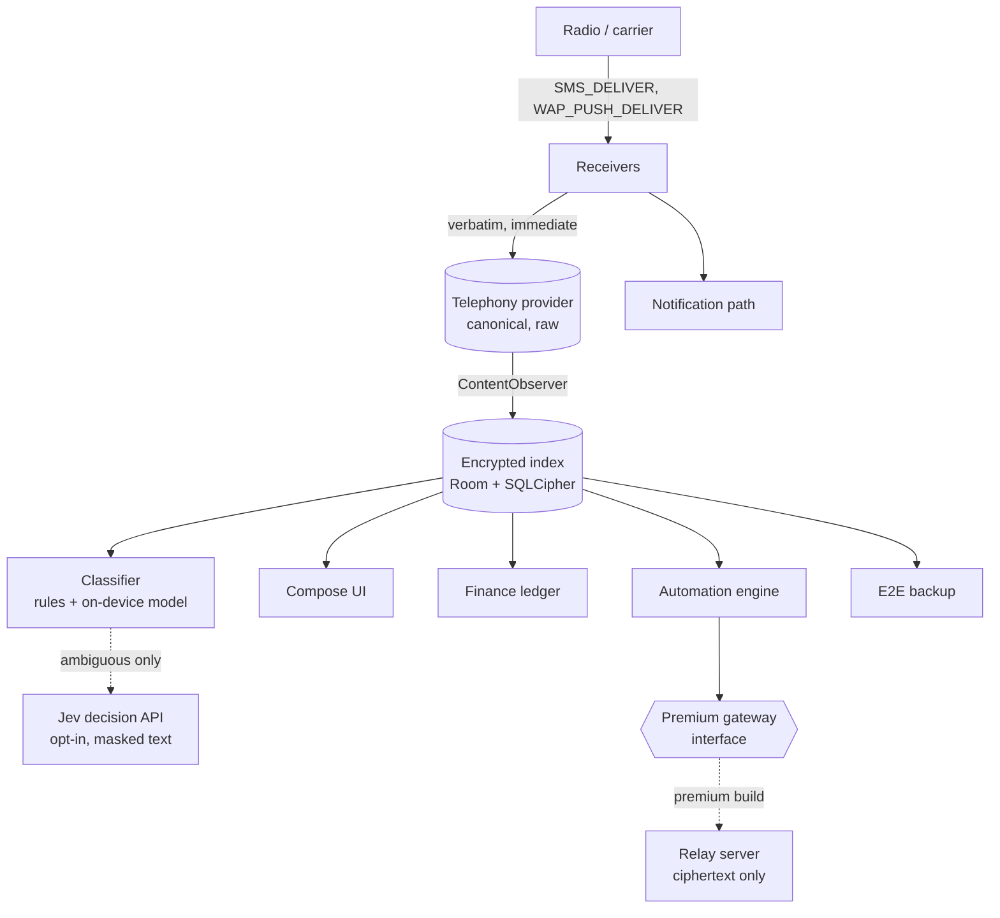

# SMS App: Build Plan

Sep 22, 2026 · @Someone

## Product thesis and constraints

We are building the Android default-SMS app for people whose texts are OTPs, bank alerts and tickets, not chats: the audience Microsoft SMS Organizer left behind when it began sunsetting in May 2026 with 1M+ installs and no maintained successor. Free tier is fully on-device; premium adds the server-backed pieces (web access, webhooks, send API) later without a rewrite.

### Platform reality

| Platform | What is possible | Consequence |
| --- | --- | --- |
| Android | Full SMS/MMS handling once the user grants the default-SMS role (`RoleManager.ROLE_SMS`); Play policy permits SMS permissions for the default handler | The whole product lives here; Kotlin + Jetpack Compose, single native app |
| iOS | No SMS read/send/replace API; only an `ILMessageFilterExtension` (classify unknown senders) and Shortcuts | At most a spam/transaction filter extension plus a companion that shows data synced from the Android app. No parity promise, ever |
| RCS | No public third-party RCS API; Google Messages holds it | Users lose RCS when they switch to us. Position as "the app for messages that matter", not for chatting |

**Positioning in one line:** the messages that matter, organised, backed up, and never uploaded without your say-so.

### Non-negotiables carried through every phase

- The system Telephony provider stays raw and canonical; every enrichment lives in our own encrypted index (see Architecture).
- Free tier never touches a server for message content. Premium server components only ever see ciphertext.
- Open export format from day one, so the "another Microsoft that vanishes" objection has an answer.
- Multi-SIM is a first-class dimension of every message, thread, filter and automation, not metadata.

## Build vs. start from an existing codebase

Recommendation: start from scratch in Kotlin + Compose, and use the open-source apps as reference implementations for the telephony plumbing rather than as a fork base. Every credible starting point is GPLv3, which would force the entire app, including future premium client features, to ship as GPL; none of them has categorisation, finance parsing, or a data layer we would keep; and all of them are XML-view codebases carrying 2015-era architecture.

| Candidate | Stack and state (Sep 2026) | Licence | What it has | Why not fork |
| --- | --- | --- | --- | --- |
| [QUIK](https://github.com/quik-sms/quik) (QKSMS continuation) | Kotlin, 2.8K stars, 178 forks, 270 open issues, v4.3.4 Jan 2026; vendors [android-smsmms](https://github.com/klinker41/android-smsmms) in-tree; RxJava + Realm + XML views inherited from QKSMS (approximate, from memory) | GPLv3 | Scheduled send, backup, blocking/archiving, MMS via klinker library, notification quick actions | Legacy reactive/Realm stack, no categorisation, GPL |
| [Fossify Messages](https://github.com/FossifyOrg/Messages) | Kotlin 99.9%, 1.4K stars, 154 forks, 179 open issues, v1.9.1 Jul 2026; depends on Fossify Commons; XML views | GPLv3 | Clean SMS/MMS send-receive, group MMS, keyword blocking, export/import backup, scheduled send, SIM handling | No categorisation (an open request, [issue #755](https://github.com/FossifyOrg/Messages/issues/755), explicitly cites SMS Organizer), tied to Fossify Commons, GPL |
| [Deku SMS](https://github.com/dekusms/DekuSMS-Android) | Mostly Java, 599 stars, v0.75.0 Jul 2026; E2EE SMS, cloud forwarding, RabbitMQ gateway | GPLv3 | The closest thing to our premium ideas (forwarding, gateway) | Java, MMS historically broken as default app, small team, GPL |
| [android-smsmms](https://github.com/klinker41/android-smsmms) (Klinker) | Java library; archived read-only 13 Mar 2026; 697 stars, 270 forks | Apache 2.0 | MMS PDU handling and legacy MMSC transactions | Archived; pre-API-21 approach. Useful as reference for PDU parsing only |

### What we take from them anyway

- Read QUIK and Fossify for the edge cases: `SMS_DELIVER`/`WAP_PUSH_DELIVER` receivers, writing to `Telephony.Sms`/`Mms`, group MMS threading, SIM subscription handling, exact-alarm scheduling on Android 13+. Learning from GPL code is fine; copying it into a non-GPL app is not.
- Fossify's export format is a reasonable interop target: support importing it, alongside SMS Organizer's Drive backup and the common SMS Backup & Restore XML.
- Deku's forwarding and gateway model shows the shape of the premium tier and its abuse surface.

**Demand signal:** the Fossify request for on-device categorisation names SMS Organizer as the reference and has sat open; the migration write-ups say no single app replaces it and Mezo (the closest) sits at 3.76 stars with stability complaints. The gap is real and unfilled by the FOSS projects.

## Architecture

One Android app, layered so the free tier is complete on-device and the premium tier plugs in behind interfaces that exist from day one.

Incoming messages hit the provider before anything else; every smart feature reads from the index, never from the provider, and the premium gateway is an interface with a no-op implementation in the free build. This section covers the plumbing only: the data layers, classification, multi-SIM, backup, the automation engine and the stack. What the user actually gets is specified in Feature design, and how it is controlled in Settings design.

### Layer 1: Telephony provider, canonical and untouched

- On `SMS_DELIVER`, write `address`, `body`, `date`, `sub_id`, `read`, `seen` to `Telephony.Sms.Inbox` immediately and verbatim. No dedupe, no reformatting, no delay. This is what keeps OTP-reading apps (SMS Retriever API, `SMS_RECEIVED` listeners, provider readers) working.
- Post the notification with the message text; Android's own OTP autofill and WebOTP read from notifications and Play Services, not from us.
- MMS: on `WAP_PUSH_DELIVER`, persist the notification-indication, then `SmsManager.downloadMultimediaMessage()` with retry and backoff, per-SIM APN/MMSC, and a visible "tap to retry" state carrying the failure reason. This is the gap SMS Organizer never closed.

### Layer 2: encrypted index (Room over SQLCipher)

- Row per provider message keyed by provider `_id` + `sub_id`; enrichment columns: canonical sender, category, confidence, labels, merge group, extracted transaction, schedule state.
- Rebuildable from the provider at any time; if the index corrupts nothing is lost. Backfill is two-stage and never blocks first run (Mezo took \~1 hour on 42K messages). Stage 1 indexes the most recent messages (last 30 days or 1,000 messages, whichever is larger) immediately in the foreground, so the app is usable within seconds. Stage 2 indexes the rest as a WorkManager job whose constraints the user picks during onboarding, borrowing the Android system-update pattern: "Now (uses battery)", "When plugged in" (\`setRequiresCharging\`), or "Tonight" (a window such as 01:00–05:00 with \`setRequiresBatteryNotLow\` and \`setRequiresDeviceIdle\`, falling back to the next night if the battery is under the threshold). Messages not yet indexed still show in threads from the provider, just without category or finance enrichment, and a progress row in settings shows what remains. The same scheduler handles re-indexing after a template-bundle update or a restore.
- Sender merge groups are display-layer: `VM-HDFCBK`, `JD-HDFCBK`, `AX-HDFCBK` collapse to one "HDFC Bank" thread in the UI; the provider keeps them distinct. User-editable, undoable.

### Classification pipeline

1. Deterministic templates: signed JSON bundle of DLT sender headers and bank/OTP regexes, updated over the air without an app release. Covers the bulk of Indian transactional traffic offline.
2. On-device model (small TFLite or ONNX) for OTP / transaction / promo / spam / personal on the remainder.
3. Jev, opt-in and only for low-confidence cases: send the sender header plus a masked body (digits, amounts, names tokenised), receive a typed choice with probability; below threshold, leave uncategorised rather than guess. Jev returns typed decisions in 70–500 ms at $0.042 per million input tokens, so cost is negligible even at scale.

### Multi-SIM

- `SubscriptionManager` for active subscriptions, carrier, slot, colour; SIM chip on every bubble and thread.
- Each thread stores its reply SIM (default: SIM of the last incoming); composer has a one-tap switcher; send via `SmsManager.getSmsManagerForSubscriptionId(subId)`.
- Automations and filters take SIM as a predicate. Handle SIM removal (chip greys out), eSIM swaps, and DSDS single-radio send failures with queue-and-retry.

### Backup and export

- End-to-end encrypted, user-held key (passphrase or device key + recovery code), incremental, to the user's own Drive or Dropbox via their account; we never hold plaintext.
- Open format: JSON manifest + message parts + attachments; also export to SMS Backup & Restore XML. Restore writes back into the provider, then the index rebuilds.
- Importers on first run: SMS Organizer Drive backup, SMS Backup & Restore XML, Fossify export.

### Automation engine

- Rule = trigger (sender, regex, category, SIM, time, keyword) + conditions + actions. Free actions: label, archive, notify, forward as SMS, schedule reply, launch intent. Premium actions register through the same `Action` interface: signed webhook POST, relay to web client, inbound send API.
- Scheduled sends via `AlarmManager` exact alarms (permission flow on 13+) with WorkManager fallback; respect the 30-per-30-minute system send limit by spreading bulk.
- Rules are stored as a small versioned JSON AST and evaluated by a pure-Kotlin engine, so they are testable, exportable and eventually shareable as presets. The user-facing premium automation built on this engine, relay rules, is specified under Feature design.

### Stack and modules

- Kotlin, Jetpack Compose, Room + SQLCipher, WorkManager, Hilt, Kotlin coroutines/Flow. minSdk 26.
- Gradle modules: `:core-telephony` (receivers, provider I/O, MMS), `:core-index`, `:classify`, `:finance`, `:automations`, `:backup`, `:premium-api` (interfaces only), `:app-free`, `:app-premium` flavours sharing everything above.
- Desktop/web client (premium) as one TypeScript codebase; iOS filter extension as a separate small Swift target that consumes a synced, classified sender list.

## Feature design

Architecture above is the plumbing; this section is the product spec that sits on it. Every feature reads from the encrypted index, never the provider, and its tier follows the rule in Free vs. premium: on-device is free, server-backed is premium, with a few value gates noted where they apply.

### Composer and thread experience

The target is one composer and one thread where text and media mix without the user ever choosing between SMS and MMS. The seams are carrier limits and missing protocol features; the design hides the first and is honest about the second.

- One composer: text field with an attachment tray (camera, gallery, files, contact card, GIF, voice note, location as a maps link). Adding media or exceeding the SMS segment limit switches the message to MMS automatically, shown as a small "MMS" chip in the send button rather than a dialog. Long text stays SMS as concatenated segments with a segment counter only when it matters (roaming, or over 3 segments).
- Media handling: images and video are compressed on-device to the per-carrier MMS limit (bundled table, typically 300 KB–1 MB, overridable per SIM) with a quality slider in Advanced; the original is kept in the thread gallery so what the user sees is not the degraded copy. Audio voice notes as AMR/AAC within the limit. Multi-image sends become one MMS per carrier limit, sequenced.
- Thread rendering: inline images, video with inline play, audio waveform player, contact cards as tappable chips, link previews rendered only after the user taps (no automatic fetch, for privacy and data), quoted replies via swipe-to-reply (rendered as quoted text; the protocol has no reply linking), and iPhone reactions that arrive as text collapsed into a reaction chip under the original message.
- Group MMS: proper group threads keyed by participant set, sender attribution per bubble, and the ability to add or leave a group conversation locally.
- Thread tools: per-thread gallery and files tab, search within thread, pin, mute, archive, star, and the SIM chip and reply-SIM switcher from Multi-SIM.
- What SMS cannot do, stated plainly in onboarding: no typing indicators, no read receipts, no sending reactions, no high-resolution media. Delivery reports stand in for read receipts where the carrier supports them.
- Performance: Paging 3 for threads, thumbnail caching, media decoding off the main thread, and a 60 fps target on mid-range devices, since the feel is mostly speed.

### Theme and appearance

- Light and dark themes are first-class, with the default following the system setting (`isSystemInDarkTheme()`), switching live when the system does, with no restart and no flash. A manual override (light, dark, system) lives in Settings and syncs into the backup.
- Material 3 with dynamic colour from the wallpaper on Android 12+, and a designed fallback palette below that. Category colours (Transactions, OTP, Promotions, Spam) and SIM colours are defined as semantic tokens with separate light and dark values, tuned so contrast meets WCAG AA in both, rather than a single hue inverted.
- True-black (AMOLED) variant of dark as an option, since it is what the SMS Organizer crowd asked Microsoft for (its "save battery with dark theme" pitch), and a high-contrast option that follows the system accessibility setting.
- Everything themed through tokens, not hard-coded colours: bubbles, chips, OTP highlight, finance ledger, charts, widgets, notification accents and the settings screen, plus splash and system bars, so there is no screen that lags behind on a theme switch. A theme-review pass in the device-farm matrix checks both themes on every screen before release.
- Per-thread bubble colour and font-size settings are cosmetic, exposed in the thread menu, and stored per thread; they never override the theme tokens for accessibility-critical elements.

### Search and filtering

- Search is a screen in the back stack, not a mode on the inbox: query, active filters, results and scroll position are held in a `SavedStateHandle`-backed ViewModel keyed to that back-stack entry. Opening a result pushes the thread on top; back returns to the same results at the same scroll position with the query intact, every time. The opened message is highlighted in the thread and the thread opens scrolled to it, with a "back to results" affordance in the top bar.
- Query language, Gmail-style, typed or built from chips: `from:` (sender, merge group or contact), `category:`, `sim:`, `has:attachment`, `has:link`, `has:otp`, `amount:>500`, `before:`/`after:`/`during:` (natural dates like "last week"), `in:archive`/`in:bin`, `is:starred`/`is:unread`. Chips appear under the search field as filters are added; a filter sheet offers the same set for people who will not type operators. Filters combine with AND; `OR` and quoted phrases are supported in the text.
- Results: grouped by thread with the matching message shown, match terms highlighted, most recent first with an option to sort by relevance or amount. Saved searches ("Amazon refunds", "SIM 2 OTPs") pin to the inbox as virtual folders and can drive automations.
- Engine: SQLite FTS5 inside the SQLCipher index, with a tokenizer that handles Indic scripts and transliterated Hinglish; structured filters resolve against the enrichment columns so `amount:` and `category:` are index lookups, not text scans. Typed-ahead suggestions from recent queries, senders and contacts.
- AI-assisted search (premium): a free-text query like "how much did I spend on Swiggy last month" or "the OTP from HDFC yesterday evening" is translated into the same structured query plus keywords, so the user sees the chips the AI produced and can adjust them. Two layers: query understanding sends only the query text (never message content) to a language model, and matching runs on-device by combining FTS5 with a small on-device embedding model over the index for semantic hits ("food delivery" finding Zomato and Swiggy). Amount and count questions are answered from the finance ledger with the supporting messages listed. Runs offline in degraded mode (keywords and filters only) when there is no connection.

### OTP lifecycle and recycle bin

- Auto-delete for OTPs: on by default, removing a message classified as OTP a set time after it arrives (default 24 hours; the free tier can also pick 1 hour or off). A "delete now" quick action sits on the notification and the bubble, so the manual path stays one tap.
- Recycle bin: every deletion is a soft delete. The message is copied into a bin table in the encrypted index with its full content, category, SIM and a `deletedBy` field (`auto-rule` with the rule name, or `manual`), then removed from the Telephony provider. Restore re-inserts it into the provider in its original thread. The bin is a screen under the inbox overflow and in Settings → Backup and data.
- Retention: OTPs stay in the bin for 1 day by default, since almost all have expired by then; other deleted messages stay 30 days. Both are purged by a WorkManager job. Adjusting the OTP retention (shorter, longer, or "until I empty it") is a premium setting; the free tier keeps the 1-day default.
- Privacy: the bin is excluded from backup by default and can be put behind biometric unlock, since it deliberately holds recent OTPs.
- The bin also gives the automation engine a safe undo: any rule that archives or deletes shows "undo" for a few seconds and lands in the bin after that.
- Consumed-OTP detection: OTPs meant for an app's automatic read carry an 11-character SMS Retriever hash at the end of the message, derived from the target app's package name and signing certificate. On install and on package changes we compute that hash for every installed app (the same routine Google publishes as `AppSignatureHelper`) and keep a table; an incoming OTP whose hash matches an installed app is marked `consumedBy: <app>`. WebOTP messages (`@domain #code`) are matched to installed browsers the same way. For a consumed OTP the default is a silent, low-priority notification (no heads-up, no sound) that the user can still open, and auto-delete after a short window (default 10 minutes, never under 5, so a retrying app can still fetch it) into the bin with `deletedBy: auto (consumed by <app>)`. Unmatched OTPs keep the normal loud path. This is a setting (Notifications → Advanced) with three values: silent + auto-delete (default), silent only, treat as normal.
- Limits: apps that read the provider directly with `READ_SMS` cannot be detected, and the User Consent API shows a system prompt anyway, so neither needs handling. The Telephony provider write is unchanged; the feature only decides how loud we are and when we tidy up.

### Finance ledger and foreign transactions

- Every parsed transaction stores the original amount and ISO currency code as written in the SMS (`AED 120.50`, `USD 42.10`, `$`, `€`), never a pre-converted number. The home currency is per account, taken from the bank's own SMS (INR for Indian accounts) rather than assumed.
- Foreign transactions get an indicative home-currency value from a rates table (rate and rate date stored alongside), shown with an "≈" and the rate used. The rates table is a small daily fetch of public mid-market rates (ECB or an equivalent open source), bundled with the OTA template update; it carries no user data, so it stays in the free tier.
- Reconciliation: when the bank's settlement SMS arrives with the actual INR debit (typically 1–3 days later, including the forex markup), match it to the estimate by card last-4, amount within a tolerance band, and date proximity, then replace the indicative value and mark the transaction settled. The difference is shown as the effective markup, which users otherwise never see.
- Balances: never invent one. After a foreign transaction, the account balance shows "unknown since \<date>" until the next balance-bearing SMS, while ledger totals continue on indicative values. This is the exact error SMS Organizer reviews complained about (wrong balance from stale messages), so honesty beats a number.
- Cards vs. accounts: credit-card foreign spends affect the card's outstanding, not a bank balance; the ledger models a card as its own account with a billing cycle, so a foreign trip does not corrupt the savings-account balance.

### Roaming and language

- Number normalisation (free, on by default, toggle in settings): every outgoing address is normalised to E.164 with libphonenumber, using the home country of the SIM being used (`SubscriptionInfo.countryIso`), not the network the phone is currently on. A saved contact or old thread stored as `98xxxxxxxx` becomes `+9198xxxxxxxx` before send, so replies keep working when roaming. Skip short codes (fewer than 7 digits) and alphanumeric sender IDs, which must never be prefixed. Thread matching uses the normalised form so the reply lands in the existing thread rather than opening a duplicate. Show a small "sent as +91…" hint the first few times so the behaviour is visible, and let the user correct the home country per SIM.
- Roaming awareness: `TelephonyManager.isNetworkRoaming` per subscription drives a chip on the composer ("Roaming on SIM 2") and a warning before bulk or scheduled sends, since roaming SMS is billed differently.
- Translation (premium): language detection on every incoming message, with on-device translation through ML Kit language packs (offline, no message content leaves the phone, so the privacy promise holds even inside the paid tier). Tap-to-translate on the bubble, an optional auto-translate rule for a chosen sender or for any message not in the user's languages, and a per-thread "always translate" toggle. Covers the roaming case (host-operator messages in the local language) and the domestic case (Indian regional languages). SMS Organizer's last feature release was exactly this, so it is a known want. Because ML Kit runs on-device, translation is a value gate rather than a server-cost gate; a possible free taster is one language pack, with unlimited packs and higher-quality cloud translation in premium.

### Relay rules (premium)

- "When a message of this type arrives from this channel, send it on to this person." Trigger = sender or merge group + category (payment credit, payment debit, OTP, delivery) + optional amount or keyword match. Recipient = a contact chosen from a suggestion list the index builds from people the user has forwarded to before, replied to most, or named in similar messages.
- Delivery channels: SMS forward (fully unattended, sent from the chosen SIM); WhatsApp one-tap (a notification action opens WhatsApp with recipient and text prefilled; WhatsApp has no personal-account API and automating it breaks its terms, so the user's final tap is required); webhook (unattended, for users with their own WhatsApp Business API or a Slack/Telegram bot). The forwarded text is an editable template ("Payment of {amount} received from {payer} at {time}"), defaulting to the raw message.
- Safety: OTP-forwarding rules require biometric confirmation to create and to change the recipient, show a persistent "forwarding OTPs from X to Y" row in Settings, and pause automatically if the recipient's number changes in Contacts. Every relayed message is logged in the automation audit log with rule, recipient and channel, and appears in the source thread as "forwarded to Y".

### Spam, fraud and sender identity

Google's SMS spam verdicts and its caller-ID database are internal to Google Messages and the Google Phone app; no API exposes them to third-party apps. Truecaller and Hiya built their own databases and got in front of Google by holding the Android roles on offer (call screening, default SMS). We follow the same path: use the platform hooks that exist, and build our own sender-identity signal that can later serve calls as well as texts.

- System blocked numbers: read and write `BlockedNumberContract` as the default SMS app, so blocks made in the Phone app apply to us and ours apply to calls. Show the shared list in Settings → Categories and spam.
- Known vs. unknown: Contacts lookup plus the bundled DLT header-to-brand table decides whether a sender is known; unknown numeric senders with a link get the strongest warning treatment.
- Link safety: unshorten and check every URL against Google Safe Browsing (Web Risk API) and a bundled list of Indian bank, government and courier domains for lookalikes; warn on the bubble before the link opens and require a second tap to proceed.
- Our own spam signal: on-device classifier scores, plus a consented crowd report stream. "Report spam" sends sender header, a template hash of the body (digits and names stripped) and the category vote, never the message text. User blocks are the strongest vote: with the same consent, a block (in our app or via the shared system list) sends the sender header and a block event, and an unblock sends a retraction, so the reputation reflects what people actually do rather than only what they bother to report. Blocks by contacts-saved senders are excluded to avoid personal disputes polluting the list. Aggregated reports feed the OTA bundle's sender reputation list; a sender crossing a threshold is auto-filed to Spam for everyone with a "community flagged" label the user can override.
- Sender identity table: header or number → brand name, logo, category, reputation, first-seen and report counts. Designed from the start as a shared asset for SMS and calls, so taking `ROLE_CALL_SCREENING` later (Truecaller-style caller ID and spam-call screening) is a new consumer of the same table, not a new database. Not in scope for v1.
- One-tap report to TRAI: forward in the 1909 format, and to the user's carrier's spam short code where one exists.
- Duplicate OTP collapse: identical OTP bodies from the same sender within a few minutes show as one bubble with a count.

## Settings design

The goal is that most users never open Settings, and the ones who do find the one row they came for in under ten seconds. Defaults carry the product; Settings is a search box first and a tree second.

### Principles

- Good defaults over choices: every setting must justify itself with a real user who needs the other value. If nobody would change it, it is not a setting.
- Search first: a search field at the top of Settings, indexed on title, summary and a synonym list per row ("OTP", "one time password", "code"), deep-linking to the exact row with it highlighted, as Android's own Settings does. Long-press any control anywhere in the app to jump to its setting.
- Seven top-level groups at most, ordered by how often people touch them. Each group shows its rows' current values inline, so a scan answers "what is this set to" without tapping in.
- Progressive disclosure per group, not a global "advanced mode": a collapsed "Advanced" block at the bottom of each group holds the rarely-touched rows. The user opens only the depth they need.
- Settings live where they matter too: a thread's SIM, notification, translation and auto-archive rows are reachable from the thread's menu; the same rows, not copies.
- Hide the irrelevant, show the locked: rows that cannot apply (SIM 2 options on a single-SIM phone, MMS options with no data plan) disappear; premium rows stay visible, greyed, with a lock chip and a one-line reason, and tap opens the upgrade sheet. Visible premium rows are the free tier's best sales page; hidden ones sell nothing.
- Every row has a one-line plain-language summary of what it does and, where it costs something (battery, data, roaming), says so in that line.
- Reset per group and "export settings" into the backup, so a restore brings the configuration back with the messages.

### Proposed groups

| Group | Holds | Advanced block |
| --- | --- | --- |
| Notifications | Per-category alerts, OTP display size, OTP auto-delete timing, quick actions, self-test | Sound per SIM, bubble, lock-screen privacy |
| Categories and spam | Tab set, sender merges, block list, auto-archive promos after N days | Classifier confidence threshold, Jev opt-in and cap |
| Finance | Accounts and cards, home currency, hide balances on lock screen | Rates source, reconciliation tolerance |
| SIMs and sending | Per-SIM name and colour, default reply SIM, number normalisation, roaming warnings | Delivery reports, send-rate spreading, exact-alarm permission |
| Backup and data | Destination, schedule, encryption key and recovery code, export, import | Index schedule (now / plugged-in / tonight), rebuild index |
| Automations | Rules list, scheduled sends | Webhooks, send API keys, audit log (premium) |
| Translation | Languages, auto-translate rules, downloaded packs (premium) | Pack storage location |

### Implementation

- One declarative settings registry: each setting is a record with key, group, title, summary, keywords, control type, default, tier, and visibility predicate. The registry drives the UI, the search index, deep links, per-group reset, and the settings export. Adding a setting is adding a record, never a screen.
- Tier gating reads the same `Entitlements` used everywhere else, so a purchase unlocks rows without a restart.
- Search matching is tolerant (prefix and fuzzy, all languages the app ships in) and ranks rows the user has changed before higher.

## Free vs. premium

The boundary is "does it need our servers to exist?": everything on-device is free, everything that needs a relay or an endpoint is premium. That rule keeps the free tier at zero marginal cost and makes the split a build flavour, not a fork.

| Capability | Free | Premium | Seam in code |
| --- | --- | --- | --- |
| Categories, spam, search with Gmail-style filters and saved searches, sender merging | Yes | Yes | none |
| Finance ledger (accounts, cards, balances) | Yes | Yes | none |
| MMS, multi-SIM, scheduled send | Yes | Yes | none |
| Roaming number normalisation (E.164 per SIM, toggle) | Yes | Yes | none |
| OTP auto-delete and recycle bin | Yes (1-day bin retention fixed) | Yes, retention adjustable | `Entitlements` on one setting |
| E2E backup to user's own Drive/Dropbox | Yes | Yes | `BackupTarget` interface; premium may add our storage |
| Automations: on-device actions | Yes | Yes | `Action` registry |
| Automations: signed webhooks out | No | Yes | `Action` registry + `PremiumGateway` |
| Relay rules (forward a message type from a channel to a chosen person via SMS, WhatsApp one-tap, or webhook) | No | Yes | `Action` registry + `Entitlements` |
| Translation (detect + on-device ML Kit, auto-translate rules) | No (optional one-pack taster) | Yes | `Translator` interface + `Entitlements` |
| AI-assisted search (natural-language query → filters, on-device semantic matching) | No | Yes | `QueryUnderstanding` interface + `Entitlements` |
| Web/desktop client via paired relay | No | Yes | `PremiumGateway`, `Entitlements` |
| Inbound send API (POST → phone sends) | No | Yes, rate-limited, per-key | `PremiumGateway`, `Entitlements` |
| Jev cloud classification for edge cases | Opt-in, capped | Opt-in, higher cap | `Classifier` chain + `Entitlements` |

### Rules that stop the two tiers drifting

- One Gradle project, two product flavours (`free`, `premium`) that differ only in which `PremiumGateway` and `Entitlements` implementations are bound by Hilt. Free binds no-ops; nothing else knows which flavour it is in.
- `Entitlements` is a single query point (`has(Feature)`), backed by Play Billing in premium and a constant `false` in free. UI shows locked premium actions greyed with a one-line explanation, so the free app already carries the premium surface and the upgrade path is a purchase, not a reinstall.
- Data model is identical across tiers; premium never adds columns to the index. Premium state (device pairings, API keys, webhook configs) lives in its own Room tables owned by the `:premium-api` module.
- Server side is a separate repo: relay that stores only ciphertext blobs addressed by pairing id, plus an API front that validates signed requests and pushes to the phone via FCM. No message plaintext ever reaches it; pairing keys are exchanged on-device via QR, as Google Messages for Web does.
- Premium can ship as a separate Play listing later if that is commercially cleaner; the flavour split already supports it (different `applicationId`, shared data via an export/import on first launch).

## Lessons from SMS Organizer and Mezo

SMS Organizer died of a notification bug, not a feature gap: its Play rating fell to 3.1 across 51.7K reviews, and the top-voted recent reviews all describe weeks without notifications and missed OTPs. Reliability is the product; the P0 list below ships before any smart feature.

### P0 reliability checklist

- [ ] Notification path survives Android 13+ `POST_NOTIFICATIONS`, Doze, and OEM background killers (Xiaomi, Oppo, Vivo, Realme); in-app self-test "send yourself a test SMS" and a persistent warning when the app detects it is restricted
- [ ] Provider sync via `ContentObserver` plus periodic reconcile, so new messages appear without leaving and re-entering the thread (Android 15 complaint)
- [ ] Delivery reports and sent-state correct on every SIM (Android 15 complaint)
- [ ] MMS download with retry, per-SIM APN, visible failure reason
- [ ] Index backfill two-stage: recent messages immediately, the rest on the user's chosen schedule (now / plugged-in / tonight with a battery floor); app usable within seconds of becoming default
- [ ] Restore never blanks the inbox; the provider is the truth and the index rebuilds from it
- [ ] Bank templates updated over the air; stale balances were a top-3 complaint
- [ ] Open export works from v1.0; nothing is ever trapped in our format

### Small details that earned loyalty

| Detail | Source | Notes |
| --- | --- | --- |
| OTP shown large and bold in the notification, tap-to-copy, delete from the notification | SMS Organizer reviews | Most-mentioned single feature |
| Auto-copy OTP; send OTP to WhatsApp straight from the notification | [Mezo review thread](https://x.com/smasithick/status/2006048354581528733) | Users asked for it inside the app rather than as an add-on |
| Double-tap any text to copy just that span | Mezo | Cheaper than long-press-select |
| Adjustable OTP notification size; security warning when an OTP arrives during a call | [Mezo Play reviews](https://www.appbrain.com/app/sms-organizer-mezo/com.mezo) | India-specific anti-fraud touch |
| Merge same-heading transactional senders into one thread | Samsung forum users citing SMS Organizer | Confirms the sender-merge feature is a known want |
| Passbook view of accounts, cards, spends and credits | SMS Organizer coverage | Keep it a ledger, not a budgeting app |
| Everything offline, nothing uploaded | SMS Organizer's own pitch | Free tier must keep this promise |

### Mistakes to avoid (from Mezo)

- A one-hour first-run scan on a 42K-message inbox.
- Removing a feature (labelled Transactions) and taking the user's data with it. Features may be retired; user-created data is always exportable first.
- Update instability: staged rollouts and a device-farm matrix across the Indian OEM set before every release.

## Phased roadmap

Four phases; the first two put a reliable, categorising, MMS-capable default SMS app in users' hands before any finance or automation work, because that is what the refugees need now and what the reviews say wins. Durations are working estimates for a small team; adjust once Phase 0 lands.

| Phase | Scope | Exit criteria | Working estimate |
| --- | --- | --- | --- |
| 0: Spike | Bare default-SMS app: role request, `SMS_DELIVER` → provider write → notification, `WAP_PUSH_DELIVER` → MMS download, multi-SIM send/receive, Compose thread list and thread view. Module skeleton with `PremiumGateway`, `Entitlements` and `Translator` no-ops in place | Receives and sends SMS + MMS on 2 SIMs on a Pixel and a Xiaomi; OTP autofill works in Chrome and two banking apps; notification self-test passes with battery optimisation on | 3–4 weeks |
| 1: MVP (free) | Encrypted index with two-stage backfill and the now / plugged-in / tonight indexing choice at onboarding; template classifier + on-device model; Personal / Transactions / OTP / Promotions / Spam tabs; sender merge groups; Gmail-style search with filter chips, saved searches and a preserved back stack; one composer with media, automatic SMS/MMS switching and group MMS; light/dark/AMOLED themes following the system by default; OTP notification (bold code, tap-to-copy, auto-delete); recycle bin with auto/manual deletion status and 1-day OTP retention; blocking; E.164 number normalisation per SIM with roaming chip; settings registry with search, per-group Advanced blocks and tier badging; E2E backup to Drive with open export; importers for SMS Organizer, SMS Backup & Restore XML, Fossify | P0 checklist green; a reply to a non-prefixed saved number succeeds while roaming (test with an airplane-mode + roaming-simulated SIM or a real trip); closed beta with 200 SMS Organizer refugees; crash-free sessions ≥ 99.5% | 8–10 weeks |
| 2: Finance + automations (free) | Passbook: accounts and cards from sender + last-4, balances, per-account ledger with raw SMS one tap away; foreign transactions kept in original currency with indicative conversion and later settlement reconciliation; OTA template bundle; automation engine with on-device actions; scheduled and recurring send; in-call OTP warning; link safety (Safe Browsing plus lookalike-domain list), sender identity table, consented spam reports and block votes, one-tap TRAI report; Jev opt-in for low-confidence classification | Balances match bank statements for HDFC, ICICI, SBI, Axis, Kotak, Paytm, PhonePe on the beta cohort; public launch on Play | 6–8 weeks |
| 3: Premium | Play Billing entitlements; translation (language detection, ML Kit packs, tap-to-translate, auto-translate rules); AI-assisted search (query understanding plus on-device semantic matching); paired web/desktop client over ciphertext relay; signed outbound webhooks; relay rules (SMS forward, WhatsApp one-tap, webhook) with OTP safety gates; inbound send API with per-key rate limits; optional hosted backup | Relay holds no plaintext (audited); translation verified for Hindi, Tamil, Telugu, Bengali, Marathi, Kannada plus three common roaming languages; Play policy review passed for data transfer disclosure; premium launched as flavour or separate listing | 8–10 weeks |

Milestones worth marking on the calendar: Phase 0 demo, first external beta build, Play submission, premium launch. Dates go in once Phase 0 gives a real velocity.

### Parallel tracks that start in Phase 1

- Template bundle: begin collecting real sender headers and bank formats from the beta cohort (with consent, masked) to seed the OTA bundle.
- Device-farm matrix: Pixel, Samsung One UI, Xiaomi HyperOS, Oppo/Realme ColorOS, Vivo FuntouchOS, at Android 12 through 16.
- SMS Organizer backup format: reverse-engineer now, while the app and its Drive backups still exist.

## Policy and compliance checklist

Everything we want is permitted for the default SMS handler on Play, provided consent and disclosure are built into the flows rather than the privacy policy. Verify each item against the current Play policy text before submission; the policy is revised often.

- [ ] Request SMS permissions only after the user selects us as default via `RoleManager`; never request `READ_SMS` as a standalone app
- [ ] Permissions declaration form on Play Console: default SMS handler as the core use case; SMS data used only for that purpose
- [ ] Prominent in-app disclosure and explicit opt-in before any message content leaves the device (Jev classification, premium relay, hosted backup), each separately toggleable
- [ ] Data safety form: free tier declares no data shared; premium declares encrypted transfer with user-controlled keys
- [ ] `SCHEDULE_EXACT_ALARM` justification for scheduled sends; `POST_NOTIFICATIONS` runtime request during onboarding
- [ ] Foreground service type declarations (Android 14+) for MMS download and bulk send
- [ ] Inbound send API: explicit per-key consent, rate limits, visible audit log on the phone, easy revoke; abuse review before launch
- [ ] No DLT/TRAI conflict: we send on the user's own SIM as a personal sender, never as a bulk/enterprise route
- [ ] Financial data: on-device only by default; if any finance data is ever synced, it is E2E encrypted and documented; consult on RBI/DPDP Act expectations before that step
- [ ] Onboarding explains RCS loss before the role dialog, so reviews do not blame us for a platform limit

## Open decisions

These are yours to make before or during the first build session; each changes what gets scaffolded first.

- [ ] Name and package id (needed for the Phase 0 skeleton)
- [ ] Premium delivery: flavour of the same listing, or a separate Play listing? The code supports both; marketing and review-rating risk differ
- [ ] Jev in the free tier: opt-in with a monthly cap, or premium-only?
- [ ] Backup destination for free: user's Drive only, or Drive + Dropbox at launch?
- [ ] Open-source posture: fully closed, or open-source the on-device parser and export format to answer the abandonment fear?
- [ ] Beta cohort: where to recruit the first 200 SMS Organizer refugees (the r/india and X threads from May 2026 are the obvious pool)

### Bring to the first build session

- A test phone with two SIMs, ideally one Xiaomi/Realme device
- Play Console developer account and a signing key plan
- Two or three of your own bank SMS samples per bank to seed templates (masked)
- Your SMS Organizer Drive backup, if you still have one, to reverse-engineer the format

### Sources

- [Microsoft SMS Organizer on Google Play](https://play.google.com/store/apps/details?id=com.microsoft.android.smsorganizer&hl=en-US)
- [Android Authority: SMS Organizer shutting down](https://www.androidauthority.com/microsoft-sms-organizer-shutting-down-3669132/)
- [QUIK](https://github.com/quik-sms/quik), [Fossify Messages](https://github.com/FossifyOrg/Messages), [Deku SMS](https://github.com/dekusms/DekuSMS-Android), [android-smsmms](https://github.com/klinker41/android-smsmms)
- [Fossify categorisation request #755](https://github.com/FossifyOrg/Messages/issues/755)
- [Jev 1.13 on OpenRouter](https://openrouter.ai/typesafe/jev-1.13)
- [SMS Organizer alternatives review](https://extensionbooster.net/blog/microsoft-sms-organizer-alternative-best-apps-auto-categorize-2026/)
